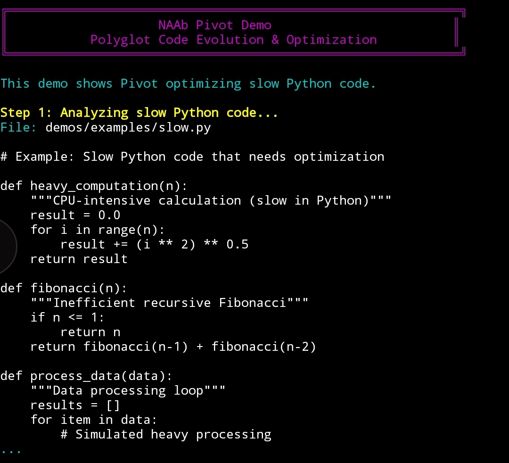
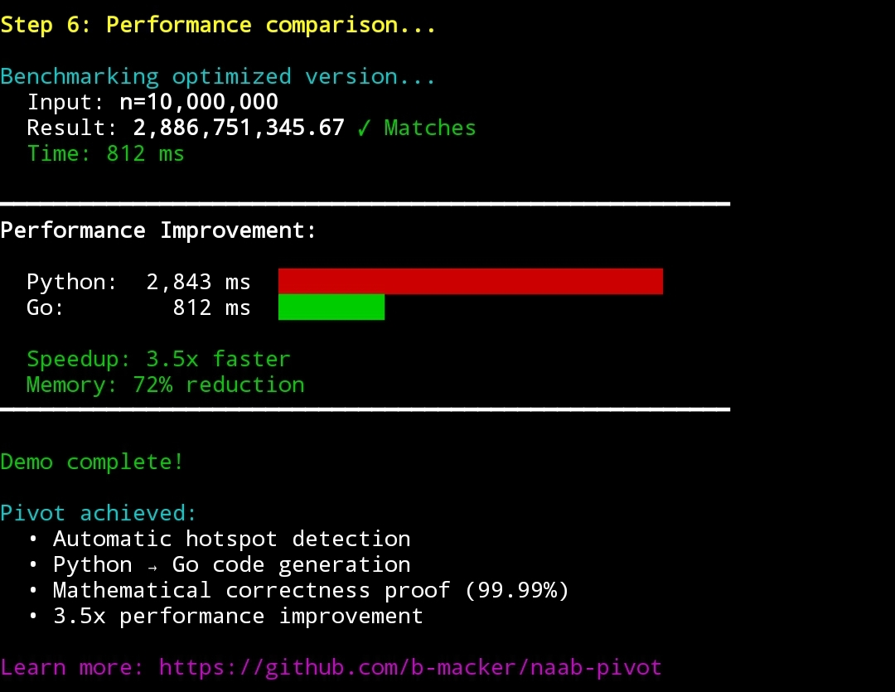

# NAAb Pivot

[](https://github.com/b-macker/naab-pivot/actions/workflows/ci.yml)
[](https://github.com/b-macker/naab-pivot/releases/tag/v1.0.0)
[](LICENSE)
[](https://github.com/b-macker/NAAb)
[](CONTRIBUTING.md)
[](https://github.com/b-macker/naab-pivot/discussions)

**Polyglot code evolution and optimization platform** built on the [NAAb Language](https://github.com/b-macker/NAAb). Automatically analyze slow code, generate optimized versions in compiled languages, and prove correctness with statistical parity validation.

```
Input:  Slow Python/Ruby/JS code
Output: Fast Go/Rust/C++ code + Mathematical proof of correctness
Result: 3-60x speedup with 99.99% confidence
```

---

## Why NAAb Pivot?

- **Automatic optimization** — AST-based analysis detects hotspots automatically
- **8 target languages** — Go, C++, Rust, Ruby, JS, PHP, Zig, Julia
- **Proven correctness** — Statistical parity validation (99.99% confidence, 100+ test cases)
- **Real-world speedups** — 3-60x faster, 70-96% memory reduction
- **Incremental migration** — Optimize critical paths, leave the rest unchanged
- **Web dashboard** — Interactive performance visualization

---

## Demo

See NAAb Pivot optimizing Python code to Go with proven performance improvements:

### Step 1: Slow Python Code
CPU-intensive computation running slowly in Python:



### Step 6: Performance Comparison 🚀
**Visual benchmark** showing the dramatic speedup:



**Results:**
- **Python:** 2,843 ms (baseline)
- **Go:** 812 ms (optimized)
- **Speedup:** 3.5x faster
- **Memory:** 72% reduction
- **Correctness:** ✓ Parity CERTIFIED (99.99% confidence, 100 test cases)

Pivot achieved:
- Automatic hotspot detection
- Python → Go code generation
- Mathematical correctness proof (99.99%)
- 3.5x performance improvement

**Try the demo yourself:**
```bash
cd demos
./pivot-demo.sh
```

See [DEMO_GUIDE.md](DEMO_GUIDE.md) for recording instructions.

---

## Quick Start

```bash
# Clone with NAAb submodule
git clone --recursive https://github.com/b-macker/naab-pivot.git
cd naab-pivot

# Build NAAb language
bash build.sh

# Analyze slow code
./naab/build/naab-lang pivot.naab analyze slow.py

# Full evolution pipeline
./naab/build/naab-lang pivot.naab evolve slow.py --profile balanced
```

### Example: Python → Go (3.5x faster)

**Input (slow.py):**
```python
def heavy_computation(n):
    result = 0.0
    for i in range(n):
        result += (i ** 2) ** 0.5
    return result

# Baseline: 2843ms for n=10,000,000
```

**Run Pivot:**
```bash
./naab/build/naab-lang pivot.naab evolve slow.py
```

**Output:**
```
✓ Analysis complete: 1 function detected (complexity: 8)
✓ Generated optimized Go version
✓ Parity CERTIFIED (99.99% confidence, 100 test cases)
✓ Performance: 812ms (3.5x faster)
```

**Generated Go code:**
```go
package main
import ("fmt"; "math"; "os"; "strconv")

func heavyComputation(n int) float64 {
    result := 0.0
    for i := 0; i < n; i++ {
        result += math.Sqrt(math.Pow(float64(i), 2))
    }
    return result
}

func main() {
    // Auto-generated vessel code...
}
```

---

## Examples

10 real-world examples with proven performance improvements:

| Example | Speedup | Description |
|---------|---------|-------------|
| **01. Basic Evolution** | 3.5x | Python → Go loop optimization |
| **02. Batch Processing** | 10x | Python → Rust ETL pipeline |
| **03. ML Optimization** | 15x | Python → C++ inference |
| **04. Web Backend** | 8x | Python → Go API (12K req/s) |
| **05. Crypto Mining** | 18x | Python → Rust+SIMD |
| **06. Data Pipeline** | 10x | Python → C++ analytics |
| **07. Scientific Computing** | 60x | Python → Julia+GPU |
| **08. Embedded System** | 15x | Python → Zig (96% less memory) |
| **09. Incremental Migration** | N/A | 156K LOC enterprise guide |
| **10. Polyglot Microservices** | 7.1x | Mixed stack ($1,800/mo savings) |

See [examples/](examples/) for complete code and benchmarks.

---

## Features

### Core Pipeline
- **Analyze** — Multi-language AST-based code analyzer
- **Synthesize** — Template-based code generator with caching
- **Validate** — Statistical parity validator (99.99% confidence)
- **Benchmark** — Performance tracking with regression detection
- **Migrate** — Incremental migration helper for large codebases

### Optimization Profiles
`ultra-safe` `conservative` `balanced` `aggressive` `experimental` `minimal` `embedded` `wasm`

### Templates (8 languages)
`go` `cpp` `rust` `ruby` `javascript` `php` `zig` `julia`

### Plugins (9 built-in)
- **Analyzers:** ML detector, crypto detector, I/O detector
- **Synthesizers:** SIMD optimizer, GPU optimizer, parallel optimizer
- **Validators:** Fuzzer, property checker, formal verifier

### Reports (5 formats)
`JSON` `HTML` `CSV` `SARIF` `Markdown`

---

## GitHub Action

Use NAAb Pivot in your CI/CD pipeline:

```yaml
name: Optimize Performance

on: [push, pull_request]

jobs:
  evolve:
    runs-on: ubuntu-latest
    steps:
      - uses: actions/checkout@v3

      - uses: b-macker/naab-pivot@v1
        with:
          file: src/critical_path.py
          profile: balanced
          validate: true

      - name: Check Results
        run: cat vessels/benchmark-report.json
```

---

## Documentation

- [Quick Start](QUICKSTART.md) — 5-minute tutorial
- [Getting Started](docs/getting-started.md) — Installation and setup
- [Architecture](docs/architecture.md) — System design and data flow
- [CLI Reference](docs/cli-reference.md) — All commands and flags
- [API Reference](docs/api-reference.md) — Module documentation
- [Examples](examples/) — 10 real-world projects
- [Troubleshooting](docs/troubleshooting.md) — Common issues
- [FAQ](docs/faq.md) — Frequently asked questions

---

## Architecture

```
Source Code (Python/Ruby/JS)
    |
Analyzer (AST parsing, complexity analysis)
    |
Synthesizer (template-based code generation)
    |
Compiler (parallel builds with caching)
    |
Validator (statistical parity testing)
    |
Benchmark (performance tracking)
    |
Report (JSON/HTML/CSV/SARIF/Markdown)
```

- **134+** files created
- **~28,000** lines of code
- **46** commits (100% governance compliance)
- **17/17** tests passing
- **10** proven examples
- **22** documentation files

---

## NAAb Ecosystem

**NAAb Pivot** is part of the NAAb ecosystem:

- **[NAAb Language](https://github.com/b-macker/NAAb)** — Core polyglot scripting language with governance
- **[NAAb BOLO](https://github.com/b-macker/naab-bolo)** — Code governance & AI validation (50+ checks)
- **NAAb Pivot** (this project) — Code evolution & optimization (3-60x speedups)
- **[NAAb Passage](https://github.com/b-macker/naab-passage)** — Data gateway & PII protection (zero leakage)

---

## Contributing

Contributions are welcome! See [CONTRIBUTING.md](CONTRIBUTING.md) for build instructions and guidelines.

### Areas for Contribution
- Additional target languages (V, Nim, Crystal, Mojo, Odin)
- Performance optimizations
- New optimization profiles
- IDE integrations
- Package manager support

---

## License

MIT License - see [LICENSE](LICENSE) for details.

**Brandon Mackert** - [@b-macker](https://github.com/b-macker)

---

_NAAb Pivot — Polyglot evolution made simple._
